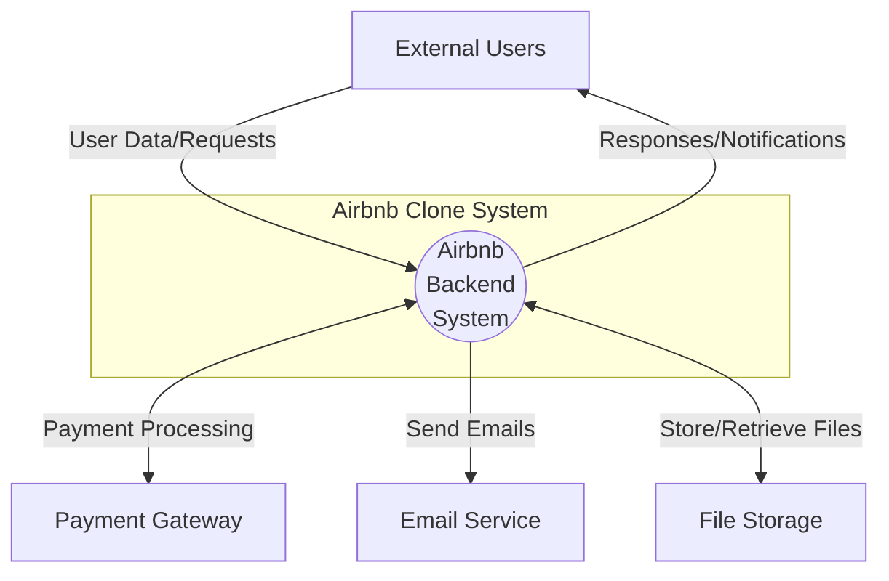
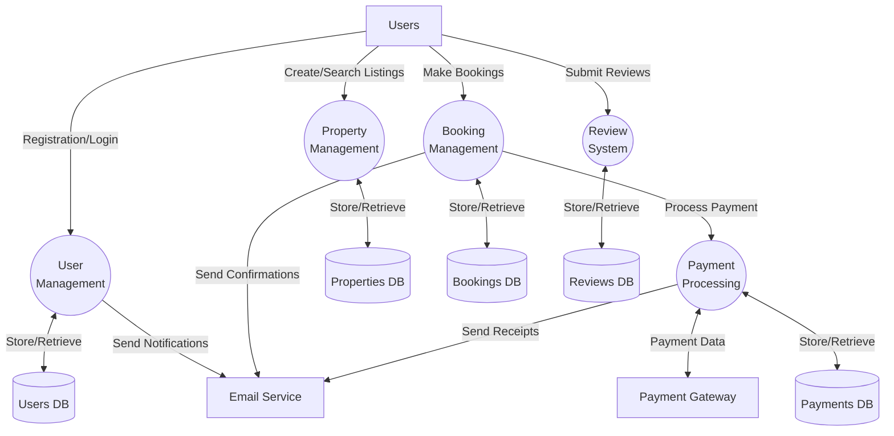
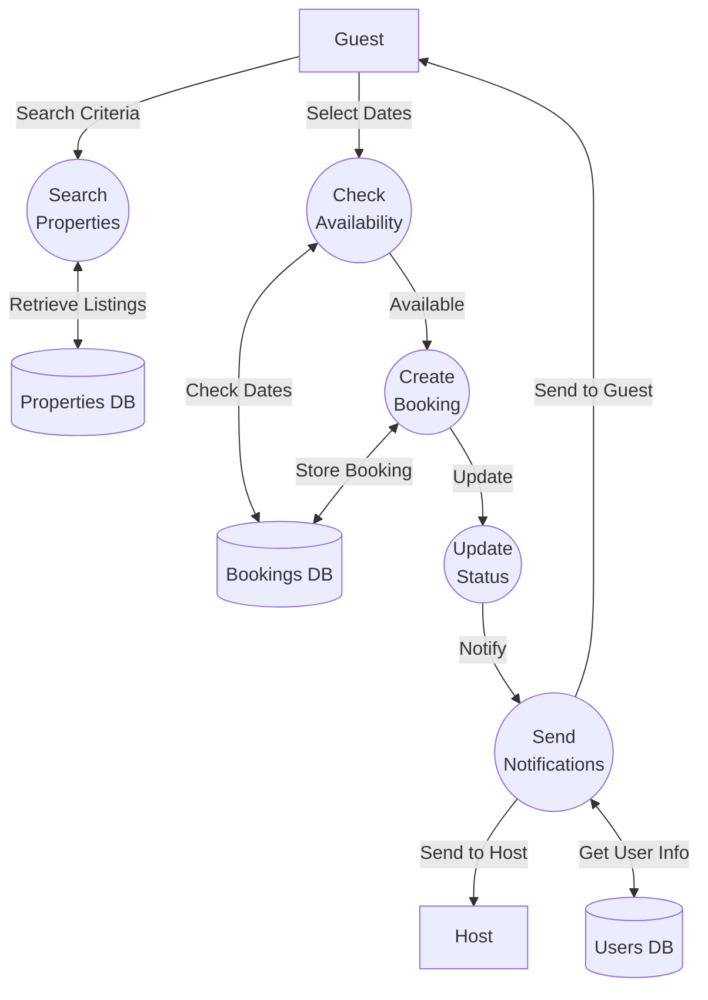

# Airbnb Clone - Data Flow Diagrams

## Context Level (Level 0)

## Level 1 (Main Processes)

## Level 2 (Detailed Process: Booking Management)

## Document Key

### Notes

1. All sensitive data flows are encrypted
2. Authentication required for all user operations
3. Data validation occurs at each process
4. Error handling implemented at all stages
